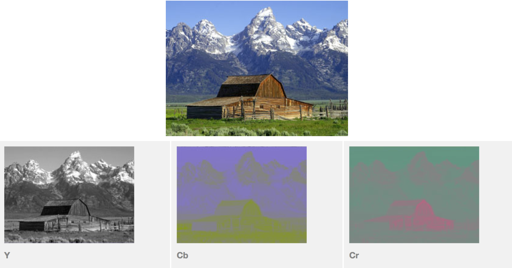
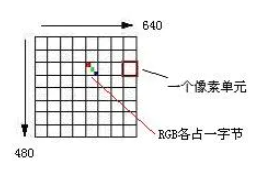
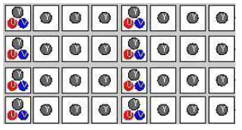
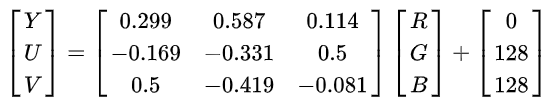
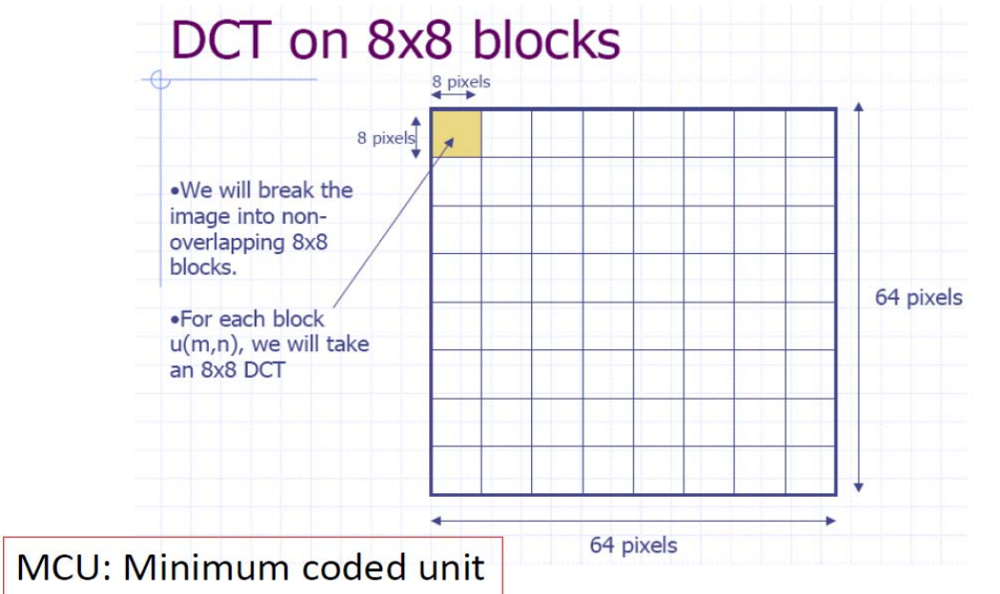
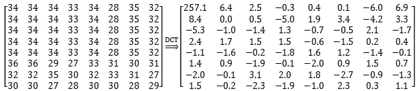
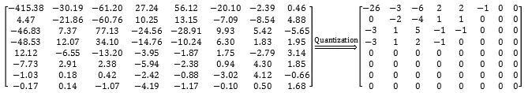

# 数字内容关键技术

## 图像获取（成像模型）

## 数字图像的空间分辨率/分辨率（Spatial Resolution）
> 指图像像素点个数

灰度分辨率(Gray Level Resolution)
> 体现显示器区分灰度的能力。

灰度分辨率越大，可展现在屏幕上的灰度越多

分辨率的大小取决于采样方式，灰度分辨率的大小取决于用于表示灰度的二进制位数，有以下公式：
> 灰度分辨率：
> L = 2k 
> b = M * N * k (bit)

图像存储大小（storage size）由分辨率和灰度分辨率共同决定 
比如分辨率为40 × 40，灰度分辨率为64（log264 = 6 bits/pixel）
那么像素的数量为40 × 40 = 1600
存储大小为1600 × 6 = 9600 bits = 1200 bytes
 
## 数字图像的DFT变换（离散傅立叶变换）

[傅里叶变换、拉普拉斯变换、Z 变换的联系是什么？为什么要进行这些变换？](https://www.zhihu.com/question/22085329/answer/774074211)

## 数字图像的DCT变换（离散余弦变换）

DCT（Discrete Consine Transform），又叫离散余弦变换，它的第二种类型，经常用于信号和图像数据的压缩。信号或图像这样相关性比较大的数据的话，经过DCT变换后的数据能量非常集中，一般只有左上角的数值是非零的，也就是能量都集中在离散余弦变换后的直流和低频部分。右下角一般都是零，再使用“之”字型Zigzag扫描得到数据流会包含很多连续的零，编码后数据量减小，这就是DCT变换带来的好处。

zigzag编码原理

## 图像编码和压缩

- 图像压缩（Image Compression）
  - 减少表示数字图像时需要的数据量
  - 去冗余（像素间相关性）
- 无损压缩（Lossless Compression）
  - 行程长度编码、熵编码法
  - TIFF、PNG、BMP等格式，应用于图形、医学图像保存

- 有损压缩（Lossy Compression）
  - 变换编码、调色板、分形编码
  - JPEG、JPEG2000等格式，高压缩比
  - 内容安全 ~ 图像压缩：紧密关联

### 图像JPEG压缩—原理
JPEG（Joint Photographic Experts Group，联合图像专家小组）：此团队创立于1986年，其于1992年发布的 JPEG 标准在1994年获得了 ISO 10918-1 的认定，成为了图片压缩标准。

JPEG 压缩为有损压缩，在保证视觉效果差别不大的情况下，压缩比可以达到几十倍。它的原理是去除图像中一些不重要的部分，从而用更小的体积保存。一个形象的例子就是“四舍五入”，比如“2.1000000001”，保存为“2.1”，就去掉了“0.0000001”，保留了重要部分做原数字的近似。下面分步骤介绍一下它的压缩算法。

#### STEP1 颜色空间转换与采样

1. 色彩空间 color space

在图像处理中，为了利用人的视角特性，从而降低数据量，通常把 RGB 空间表示的彩色图像变换到其他色彩空间。

现在采用的色彩空间变换有三种：**YIQ，YUV 和 YCbCr**

每一种色彩空间都产生一种亮度分量信号和两种色度分量信号，而每一种变换使用的参数都是为了适应某种类型的显示设备。

|色彩空间|适用范围|
|--|--|
|YIQ|NTSC彩色电视制式|
|YUV|PAL和SECAM彩色电视制式|
|YCbCr|计算机用的显示器|

YUV 不是哪个英文单词的缩写，而只是符号，Y 表示明亮度（Luma），U 和 V 表示色度（Chrominance）和浓度（Chroma）

因为人眼对亮度的差异敏感度高于对色彩的变化。考虑到这种感知能力，允许降低色度以及浓度的带宽。YUV 的色彩空间**更容易压缩 U、V 分量**。

YUV 表示法的重要性是它的亮度信号(Y)和色度信号(U、V)是相互独立的，也就是 Y 信号分量构成的黑白灰度图与用 U、V 信号构成的另外两幅单色图是相互独立的。由于 Y、U、V 是独立的，所以可以对这些单色图分别进行编码。此外，黑白电视能接收彩色电视信号也就是利用了 YUV 分量之间的独立性。
 
举例来说明一下：
颜色空间: RGB --> YUV
要存储 RGB 8∶8∶8的彩色图像，即 R、G 和 B 分量都用8位二进制数（1个字节）表示，图像的大小为640×480像素，那么所需要的存储容量为640×480×(1+1+1)=921 600字节，即900KB，其中(1+1+1)表示 RGB 各占一个字节。

如果用 YUV 来表示同一幅彩色图像，Y 分量仍然为640×480，并且 Y 分量仍然用8位表示，而对每四个相邻像素(2×2)的 U、V 值分别用相同的一个值表示，那么存储同样的一幅图像所需的存储空间就减少到640×480×(1+1/(2×2)+1/(2×2))=460 800字节，即450KB。也就是把数据压缩了一半。

对电视机，在考虑人的视觉系统和电视阴极射线管(CRT)的非线性特性之后，RGB 转化 YUV 的公式（经过 PAL制式 CRT伽玛校正）如下：

Y = 0.299R’ + 0.587G’ + 0.114B'
U = -0.147R’ - 0.289G’ + 0.436B'
V = 0.615R’ - 0.515G’ - 0.100B'

**上面符号都带了一撇，表示该符号在原值基础上进行了gamma correction(伽玛校正)**

对计算机而言，计算机用的数字域的色彩空间变换与电视模拟域的色彩空间变换不同，它们的分量使用 Y、Cr 和 Cb 来表示，与 RGB 空间的转换关系如下：

总体来说，上面讲的这些内容，主要就是对原始图片，可以先进行色彩空间的处理，使采集到的图像数据有所减少。实际上，JPEG 算法与色彩空间无关，色彩空间是涉及到图像采样的问题，它和数据的压缩并没有直接的关系。

因此“RGB 到 YUV 变换”和“YUV 到 RGB 变换”不包含在 JPEG 算法中。JPEG 算法处理的彩色图像是单独的彩色分量图像，因此它可以压缩来自不同色彩空间的数据，如 RGB，YCbCr 和 CMYK。
 
2. YCbCr子采样 (4:2:2)

YCbCr 有许多取样格式, 如4∶4∶4 , 4∶2∶2 , 4∶1∶1 和4∶2∶0

用三个图来直观地表示采集的方式吧，以黑点表示采样该像素点的Y分量，以空心圆圈表示采用该像素点的UV分量。

#### 块DCT (无损)

将图像矩阵分割成一块块8X8单位，每个单位单独用后面4个步骤处理，使用8X8尺寸进行分割的原因是：图像本身的连贯性，一个8X8的图像中的数值一般不会出现大的跳跃。

DCT可以将图像以频域的形式进行表达，经过DCT变换，图像左上角会集中低频部分的能量，右下角集中高频，数值越大，代表此处的能量越多。下图是某前辈对Lena图的第一个8∗8小块进行DCT变换的结果。

由于 DCT 变化需要定义域对称，在做 DCT 变化之前要先将矩阵中的数值左移 128，使得值域落在 -128~127：

#### DCT系数量化 (有损)

在 DCT 变化后，舍弃高频区数据的过程称为量化,就是用像素值÷量化表对应值所得的结果。有两份量化表可供选择，分别为亮度量化表和色度量化表：

但量化时候并不是随便除，经过长期的经验，人们得到了上面两张量化表，对应位置相除即可（在量化表上乘一个系数，可以得到不同的压缩比）。这两张表中的数据基于人眼对不同频率的敏感程度制定。量化后的结果如下，右下角已大部分为0。

总体上来说，DCT 变换实际是空间域的低通滤波器。对 Y 分量采用细量化，对 UV 采用粗量化。

量化表是控制 JPEG 压缩比的关键，这个步骤除掉了一些高频量；另一个重要原因是所有图片的点与点之间会有一个色彩过渡的过程，大量的图像信息被包含在低频率中，经过量化处理后，在高频率段，将出现大量连续的零。

量化是有损的，在解码时，反量化会乘回量化表的相应值。由于存在取整，低频段会有所损失，高频段的0字段则会被舍弃，最终导致图像质量降低。

#### 量化后DCT系数

**熵编码（zigzag scan & 霍夫曼编码 (无损)**

量化后的数据需要进行编码，编码信息分两类，一类是每个8×8格子F中的[0,0]位置上元素，这是 **DC**（直流分量），代表8×8个子块的平均值，JPEG中对F[0,0]单独编码，由于两个相邻的8×8子块的DC系数相差很小，所以对它们采用**差分编码DPCM**，可以提高压缩比，也就是说**对相邻的子块DC系数的差值进行编码**。

另一类是8×8块的其它63个子块，即AC(交流)系数，为了保证低频分量先出现，高频分量后出现，以增加行程中连续“0”的个数，这63个元素采用了“之”字型(Zig-Zag)的排列方法，如下图所示。

用这种顺序有利于采用**行程编码（游程编码Run-length encode,RLE）**。行程编码又称“运行长度编码”或“游程编码”，它是一种无损压缩编码。

例如：5555557777733322221111111

这个数据的一个特点是相同的内容会重复出现很多次，那么就可以用一种简化的方法来记录这一串数字，如

（5，6）（7，5）（3，3）（2，4）（l，7）

即为它的行程编码。

行程编码的位数会远远少于原始字符串的位数。

量化后的数据，有一个很大的特点，就是直流分量相对于交流分量来说要大，而且交流分量中含有大量的0。

霍夫曼编码中，在 JPEG 有个 EOB（End Of Block） 字段，表示从字段开始后面全为0，然后再根据霍夫曼编码再进行压缩。

至此，这个亮度 8*8 的像素组压缩编码完毕。

将图像每个 8*8 像素组进行编码就可以压缩整个图像了。

参考资料:
* [影像算法解析——JPEG 压缩算法](https://zhuanlan.zhihu.com/p/40356456)
* [JPEG 图片压缩原理](https://www.jianshu.com/p/0d0361fca2ab)
* [JPEG压缩原理](https://blog.csdn.net/abcjennifer/article/details/8074492)
* [JPEG图像压缩原理解析](https://wxjwjj.github.io/2018/05/14/jpeg/)
